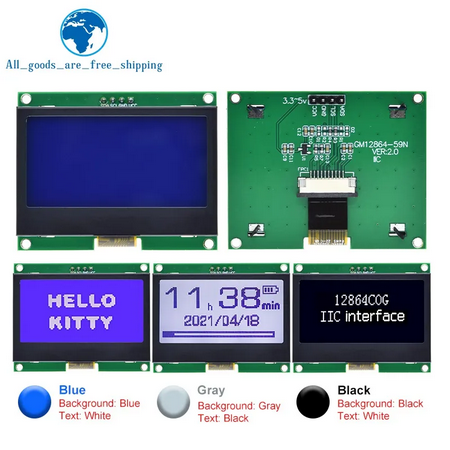
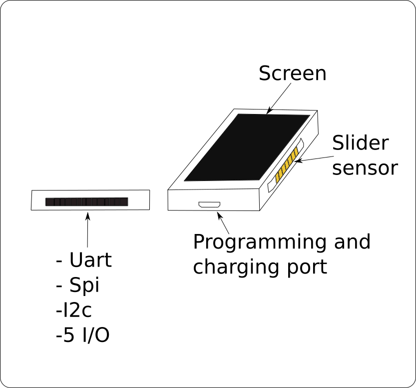
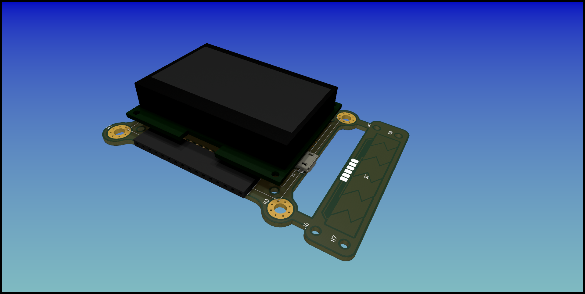
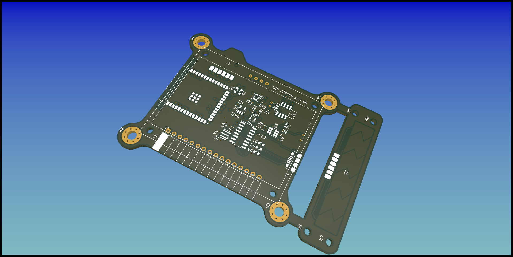
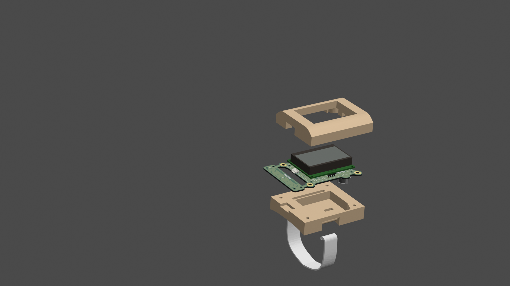

# ESP32-watchdog 

This watch will be a multipurpose watch, that will have some kind of Espressif's MCU because it's cheap a come with good features like
Bluetooth and Wi-Fi.

I want to have the more compact design, with that said, the screen and battery define the size watch. 

Searching on Aliexpress I found the next options 

|ID|Technology type|Consumption (mAh) - Voltage (V)|Communication interface|Size|Price|Resolution|
|-|-|-|-|-|-|-|
|1|TFT-LCD|95mAh-5v|UART|47,5mm diameter x 27,0mm de height|371 MX|240px|
|2|Electronic paper screen Monochrome|0.15mAh|-|1.28in|574.29 MX 2 units| 128px|

**I decided to use the next LCD screen**

[Here is the purchase link](https://es.aliexpress.com/item/1005004617618178.html)

**Maybe in the next iteration I will choose for a smaller screen**

## Links
1. https://es.aliexpress.com/item/1005005295747021.html
2. https://es.aliexpress.com/item/1005004555311346.html

## Buttons 
For applications control it is needed to have some kind of inputs, like in common watches,with the hour configured through buttons.
One option is to have capacitive buttons or micro-buttons.

## Capacitive touch sensor
Following this document https://ww1.microchip.com/downloads/en/AppNotes/Capacitive-Touch-Sensor-Design-Guide-DS00002934-B.pdf
This type of sensor touch it seems the best option, it is called "slide sensor", at "Extend Interpolation" form.

## Programming port 
The programming port it will be a micro-usb with the CHG340

## ESP32-S3's power consumption 

|Mode|Power consumption|
|-|-|
|Recommended|500(mA)|
|deep sleep|7-8(uA)|
|light sleep|240(uA)|
|wifi|355mA|

In the case that I want to use Wi-Fi with another application running for three hours on a day and with powered on screen.

## Conceptual design

## First PCB design

